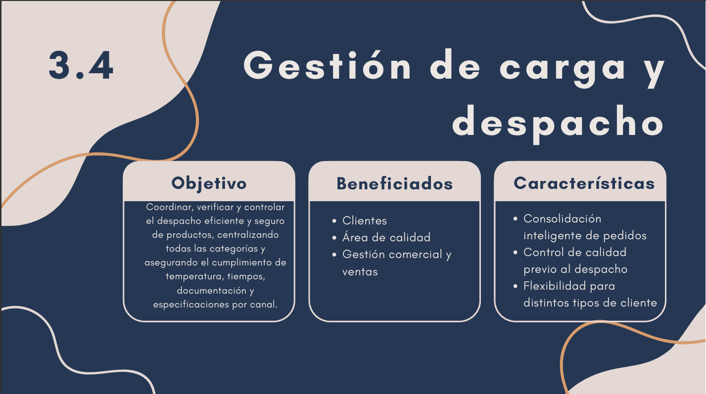

# 0.8. Presentaciones Individuales (Videos) por cada PC

# Primera práctica calificada

## 1. Fernandez Carbajal, Anthony Kevin

## 2. Champi Yauli, David Sebastian Kaleb

[video individal del módulo 2](https://www.youtube.com/watch?v=VD_s0wngTjo&ab_channel=Magikratos13)

## 3. Urbano Chocce, Yeison

[video individal del módulo 2](https://youtu.be/mdaLu4UQGQ8)

## 4. Morales Santiago, Rosse Emily

## 5. Erazo Llacsahuanga, Anthony Josue

## 6. Pfuño Quispe, José Manuel

## 7. Gomez Melchor, Ronald Enrique

# Segunda práctica calificada

## 1. Fernandez Carbajal, Anthony Kevin

## 2. Champi Yauli, David Sebastian Kaleb

## 3. Urbano Chocce, Yeison

## 4. Morales Santiago, Rosse Emily

## 5. Erazo Llacsahuanga, Anthony Josue

## 6. Pfuño Quispe, José Manuel

## 7. Gomez Melchor, Ronald Enrique

# Tercera práctica calificada

## 1. Fernandez Carbajal, Anthony Kevin

## 2. Champi Yauli, David Sebastian Kaleb

## 3. Urbano Chocce, Yeison

## 4. Morales Santiago, Rosse Emily

## 5. Erazo Llacsahuanga, Anthony Josue

## 6. Pfuño Quispe, José Manuel

## 7. Gomez Melchor, Ronald Enrique

# Cuarta práctica calificada

## 1. Fernandez Carbajal, Anthony Kevin

## 2. Champi Yauli, David Sebastian Kaleb

## 3. Urbano Chocce, Yeison

## 4. Morales Santiago, Rosse Emily

## 5. Erazo Llacsahuanga, Anthony Josue

## 6. Pfuño Quispe, José Manuel

## 7. Gomez Melchor, Ronald Enrique
