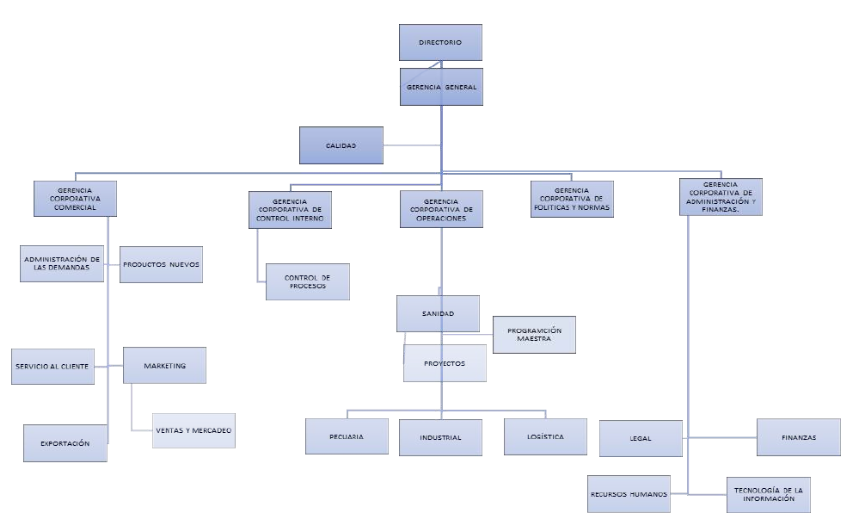

# 1.1. Datos de la Empresa

## Datos Generales
 - Razón Social: SAN FERNANDO S.A.
 - RUC: 20100154308
 - Dirección: República de Panamá N° 4575, Surquillo Lima - Perú
 - Teléfono: +522135300
 - Sitio Web: www.sanfernando.pe

## Mision
Contribuir al bienestar de la humanidad, suministrando alimentos de consumo masivo en el mercado global.

## Vision
Ser competitivos a nivel mundial, suministrando productos de valor agregado para la alimentación humana.

## Organigrama

  

## Productos
Pollo, pavo, cerdo, huevos, embutidos, congelados.

## Principales Procesos de Negocio
 - Cría y procesamiento avícola y porcina
 - Producción de alimentos procesados
 - Logística y distribución a nivel nacional
 - Comercialización mayorista, minorista y retail