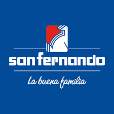

# 1. Descripción de la Empresa Elegida

    
San Fernando S.A.

    

Empresa peruana con más de 70 años de trayectoria, dedicada a la producción y comercialización de alimentos de origen avícola, porcino y procesado. Se destaca por su integración vertical en la cadena productiva, lo que le permite controlar desde la crianza de animales hasta la distribución de productos terminados. Su compromiso con la calidad, la seguridad alimentaria y el bienestar animal la posiciona como líder en el mercado nacional. Además, cuenta con centros de distribución estratégicos que le permiten llegar de manera eficiente a todos los rincones del país.