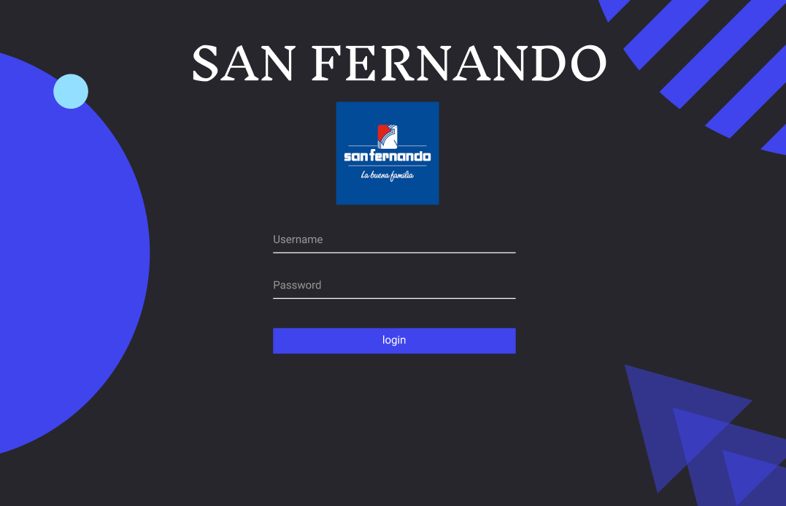
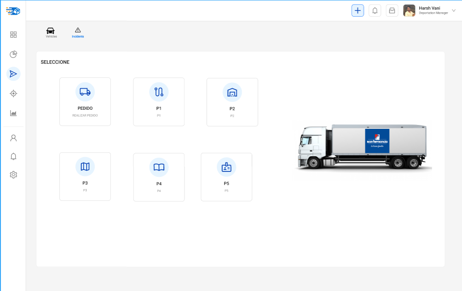
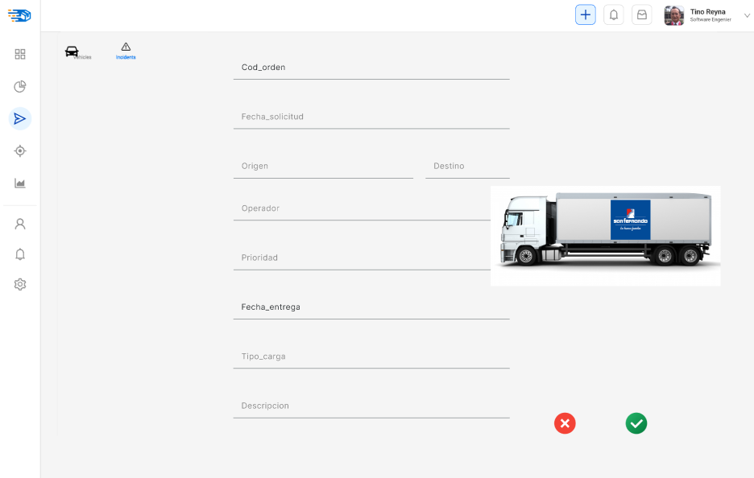

# 3.1. Módulo 1

## 🧩 Recepción de Órdenes de Transporte  
**Responsable:** Fernandez Carbajal, Anthony Kevin  
1. ¿Cuál es el objetivo de su módulo?
### 🎯 Objetivo  
Permitir el registro estructurado y oportuno de solicitudes de transporte por parte de áreas internas de la empresa, garantizando que las necesidades logísticas sean atendidas desde el inicio con información clara y precisa para su planificación y ejecución.

2. ¿A quién beneficia el funcionamiento de su módulo?
### 👥 Beneficiarios  
- **Áreas internas:** almacén, ventas, producción y distribución.  
- **Clientes (indirectamente):** personas o empresas que recibirán los productos a tiempo gracias a una mejor coordinación.
  
3. ¿Qué resultado genera su módulo? ¿Es un producto o un servicio? ¿Qué características tiene?
### 📦 Resultado  
- **Tipo:** Servicio interno.  
- **Descripción:** Registro formal de una orden de transporte.  
- **Características:**
  - Información detallada: origen, destino, prioridad, fecha inicio,fecha final.
  - Registro trazable: incluye fecha, hora y responsable.

4. ¿Qué recursos se emplean para obtener dicho resultado?
### 🛠️ Recursos Utilizados  
- Sistema de gestión ( plataforma interna).  
- Personal administrativo/logístico.  
- Formularios digitales. 

5. ¿Cómo se planifica el uso de estos recursos?
### 🗓️ Planificación del Uso de Recursos  
- Horarios definidos para ingreso de órdenes según tipo de solicitud.  
- Ventanas de tiempo para solicitudes urgentes.  
- Flujo de aprobación para solicitudes especiales. 

6. ¿Cómo se reserva el uso / la propiedad del producto o servicio generado?
### 🔐 Reserva del Servicio  
- Cada orden tiene un codigo.
- Se solicta informacion del pedido de transporte 
- Solo personal autorizado puede crear, editar o anular órdenes. 

## 📐 Especificación de Requerimientos

### 🔧 Requerimientos funcionales

| *Requerimientos*                                    | *Actividad*                                                                 |
|------------------------------------------------|-------------------------------------------------------------------------------|
| **1. Registro de Solicitudes de Transporte** | - Las áreas internas deben poder registrar sus solicitudes de transporte de forma rápida y eficiente. |
| **2. Trazabilidad de Órdenes**               | - Asegurar que cada orden esté vinculada a un código único, con fecha, hora y responsable de su creación. |
| **3. Validación de Ordenes**                     | - El sistema debe permitir la validación de las órdenes por parte de un supervisor antes de su registro. |
| **4. Generación de Reportes**    | - Generar reportes detallados con información de las órdenes registradas (origen, destino, fecha). |

### ⭐ Requerimientos de atributos de calidad

| *Atributo*         | *Descripción*                                                                               |
|--------------------|---------------------------------------------------------------------------------------------|
| **Disponibilidad** | El sistema debe estar disponible las 24 horas del día para registrar solicitudes de transporte. |
| **Rendimiento**    | El sistema debe permitir la carga de hasta 1000 órdenes de transporte por día sin caída en el rendimiento. |
| **Seguridad**      | El acceso a la plataforma será restringido según roles, con un sistema de validación de identidad (autenticación). |
| **Usabilidad**     | Interfaz intuitiva que facilite la entrada de datos para los usuarios del sistema, tanto en escritorio como dispositivos móviles. |
| **Escalabilidad**  | El sistema debe poder adaptarse a un crecimiento en el número de solicitudes de transporte y usuarios sin afectar el rendimiento. |
| **Trazabilidad**   | Registro completo de cada acción realizada sobre la orden, permitiendo auditoría en cualquier momento. |

## ⛓️ Restricciones
- El sistema solo puede permitir el registro de órdenes cuando toda la información requerida esté completa (origen, destino, fecha, etc.).
- Las órdenes urgentes deben ser registradas dentro de un horario específico, y solo pueden ser modificadas por personal autorizado.
  
## 🎛️ Menú de opciones del sistema 

- **Ingreso de Ordenes de Transporte**  
- **Consultar Órdenes Registradas**  
- **Visualizacion de Reportes**  

## 📄 Casos de uso 

### CU01 – Registrar Orden de Transporte
- **Acciones:**  
  - Ingreso de datos de la solicitud (origen, destino, volumen, prioridad, etc.).  
  - Validación de información ingresada.
  - Asignación de código único a la orden.

**Resultado esperado:**  
La orden es registrada correctamente en el sistema, con un código único asignado para su seguimiento.

### CU02 – Consultar Orden de Transporte
- **Acciones:**  
  - Buscar órdenes por código o estado.  
  - Ver detalles de la orden (origen, destino, fecha, etc.).

**Resultado esperado:**  
El usuario obtiene una consulta detallada sobre el estado de la orden y su información relevante.

## Prototipos

