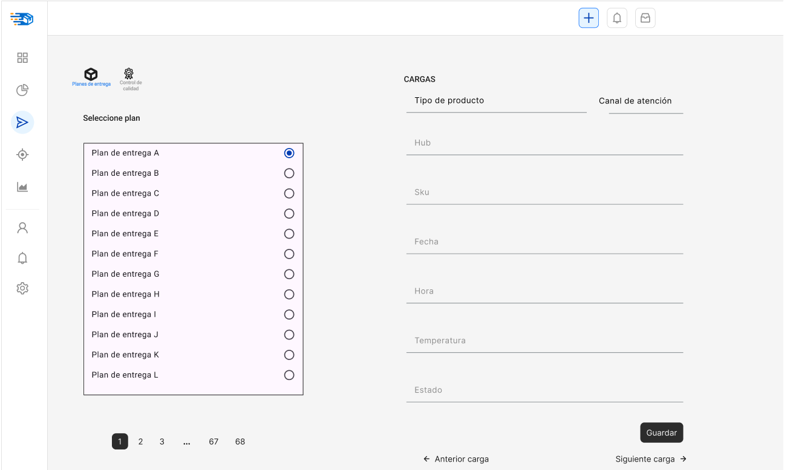

# 3.4. Módulo 4

# Gestión de despacho de la carga

## Q&A

### 1. ¿Cuál es el objetivo de su módulo?

 
 El objetivo principal del módulo es coordinar, verificar y controlar el despacho eficiente y seguro de productos, centralizando todas las categorías (pollo, pavo, cerdo, embutidos, huevos) desde los distintos orígenes hasta su entrega final, cumpliendo con las condiciones de temperatura, tiempos, documentación y especificaciones por canal de cliente.

### 2. ¿A quién beneficia el funcionamiento de su módulo?

 Este módulo beneficia tanto a áreas internas como a clientes externos. Internamente, apoya a los departamentos de producción, ventas y logística al asegurar una distribución fluida y coordinada de los productos. Externamente, beneficia a los clientes, ya sean personas o empresas, al garantizar entregas puntuales y productos en óptimas condiciones.
 - **Área de calidad**:  Verifica condiciones de temperatura y cumplimiento normativo.
 - **Clientes**: reciben productos dentro de los requisitos acordados.
 - **Gestión comercial y ventas**: alinear entregas con pedidos facturados y documentación.

### 3. ¿Qué resultado genera su módulo? ¿Es un producto o un servicio? ¿Qué características tiene?

 El resultado del módulo es un servicio de transporte y distribución eficiente y confiable. 
 Características:
 - Consolidación de carga por categorías 
 - Control de temperatura
 - Manejo de ventanas horarias y tiempos de recepción por canal
 - Control de documentación (órdenes, guías, precintos)
 - Gestión de SKU 
 - Flexibilidad para distintos tipos de cliente

### 4. ¿Qué recursos se emplean para obtener dicho resultado?

 - Flota de vehículos
 - Centros de distribución
 - Personal de calidad y logística
 - Ordenes de pedidos

### 5. ¿Cómo se planifica el uso de estos recursos?
 
 La planificación se realiza mediante:
 - Asignación de unidades: por tipo de producto
 - Calendarios de ventana horaria y entrega: vinculados al tipo de cliente
 -Rutas optimizadas con 12-17 puntos (para carnes).
 Rutas optimizadas con 25-35 puntos (para huevos).
 
### 6. ¿Cómo se reserva el uso / la propiedad del producto o servicio generado?

 - Mediante tickets de pedido y su asociación al SKU pesado.
 - Generación del pedido recién tras tener el peso final de todos los ítems.

## 📐 Especificación de Requerimientos
### 🔧 Requerimientos funcionales

| *Requerimientos*                                    | *Actividad*                                                                 |
|------------------------------------------------|-------------------------------------------------------------------------------|
| **1. Centralización y Gestión de Productos en el Hub** | - Tener información actualizada de productos al hub desde (T1). - Consolidar cargas de distintos tipos de productos (SKU). |
| **2. Gestión de SKUs y Pedidos**               | - Habilitar generación de pedidos únicamente tras completar el pesaje de todos los SKU. |
| **3. Preparación y Carga**                     | - Confirmar preparación de pedidos (picking) por parte del centro de picado. - Registrar el inicio de carga en el hub regional tras validación de preparación. - Asignar pedidos preparados a unidades específicas de transporte. |
| **4. Control de Calidad Previo a Despacho**    | - Verificar el seteo de temperatura en unidades de transporte. - Registrar datos de calibración de equipos de refrigeración. - Emitir visto bueno de calidad previo al cierre y precintado de la unidad. |
| **5. Despacho y Documentación**                | - Cerrar y precintar unidad de transporte tras aprobación de calidad. - Generar y adjuntar documentación de despacho (guías, órdenes de compra). - Registrar salida del vehículo con verificación de termoquin encendido. |

## ⭐ Requerimientos de atributos de calidad

| *Atributo*         | *Descripción*                                                                               |
|--------------------|---------------------------------------------------------------------------------------------|
| **Disponibilidad** | Alta disponibilidad 24/7 para evitar interrupciones en los turnos de despacho.              |
| **Rendimiento**    | Procesamiento de 120 rutas diarias en tiempo real.                                          |
| **Seguridad**      | Acceso segmentado por perfil; encriptación de datos y validación de documentación.          |
| **Usabilidad**     | Interfaz intuitiva para usuarios operativos, para móviles en el caso del chofer.            |
| **Escalabilidad**  | Soporte para añadir más hubs o rutas conforme crezca la operación.                          |
| **Trazabilidad**   | Registro completo de cada acción en el proceso de carga y despacho.                         |

## ⛓️ Restricciones
- Cada vehículo debe cumplir con una categoría de temperatura específica, no mezclables.
- El sistema no debe permitir despachos si algún SKU no está validado como pesado.
- El sistema debe respetar ventanas horarias específicas según el canal de atención.
- El precinto y la temperatura deben registrarse y validarse antes del inicio de ruta.

# 🎛️ Menú de opciones del sistema 

- Preparación y carga
- Control de calidad
- Despacho

## 📄 Casos de uso 

## CU01 – Preparar y asignar pedidos a unidades de transporte
- **Confirmar preparación (picking)**
- **Registrar inicio de carga**
- **Asignar pedidos a unidades**

Resultado esperado:
Los pedidos preparados son confirmados, registrados y asignados correctamente a unidades de transporte disponibles, quedando listos para el control de calidad previo al despacho.

## CU02 – Realizar control de calidad y aprobar unidad para despacho
- **Verificar temperatura**
- **Registrar calibración**
- **Emitir visto bueno y precintado**

Resultado esperado:
La unidad asignada pasa las verificaciones de calidad, recibe el visto bueno, es precintada correctamente y queda autorizada para su despacho.

## CU03 – Despachar unidad de transporte con documentación completa
- **Generar guías y documentación**
- **Registrar salida del vehículo**

Resultado esperado:
La unidad es despachada oficialmente con toda la documentación generada (guía, órdenes), con el thermoking activo y conforme al protocolo operativo de salida.

## Prototipos

