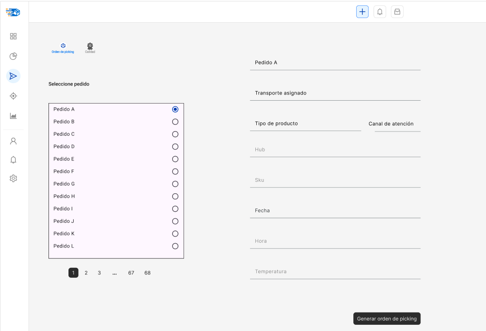
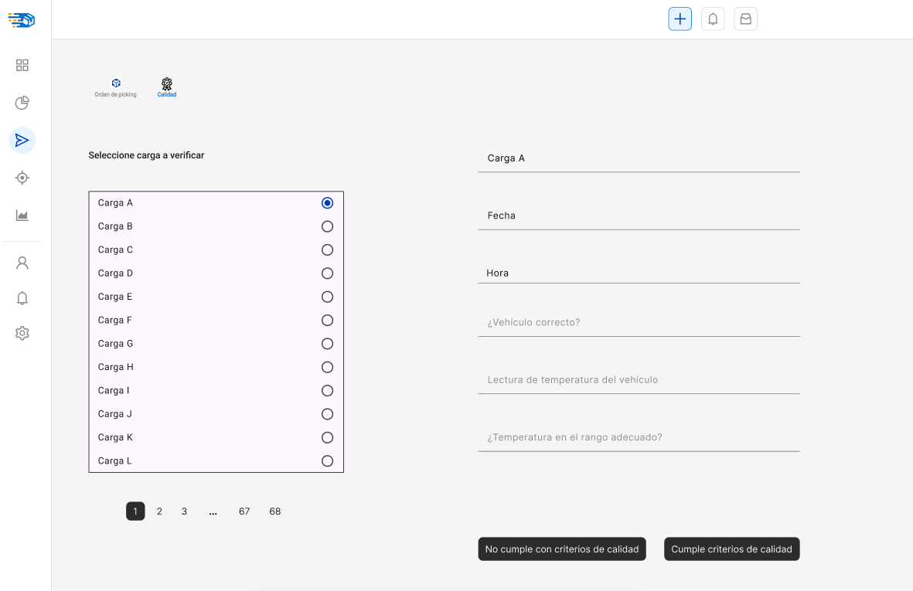

# 3.4. Módulo 4

# Gestión de carga y despacho

## Q&A

### 1. ¿Cuál es el objetivo de su módulo?

 
 El objetivo principal del módulo es coordinar, verificar y controlar el despacho eficiente y seguro de productos, centralizando todas las categorías (pollo, pavo, cerdo, embutidos, huevos) desde los distintos orígenes hasta su entrega final, cumpliendo con las condiciones de temperatura, tiempos, documentación y especificaciones por canal de cliente.

### 2. ¿A quién beneficia el funcionamiento de su módulo?

 Este módulo beneficia tanto a áreas internas como a clientes externos. Internamente, apoya a los departamentos de producción, ventas y logística al asegurar una distribución fluida y coordinada de los productos. Externamente, beneficia a los clientes, ya sean personas o empresas, al garantizar entregas puntuales y productos en óptimas condiciones.
 - **Área de calidad**:  Verifica condiciones de temperatura y cumplimiento normativo.
 - **Clientes**: reciben productos dentro de los requisitos acordados.
 - **Gestión comercial y ventas**: alinear entregas con pedidos facturados y documentación.

### 3. ¿Qué resultado genera su módulo? ¿Es un producto o un servicio? ¿Qué características tiene?

 El resultado del módulo es un servicio de transporte y distribución eficiente y confiable. 
 Características:
 - Consolidación de carga por categorías 
 - Control de temperatura
 - Manejo de ventanas horarias y tiempos de recepción por canal
 - Asignación de unidades por tipo de carga (seca vs refrigerada/congelada)
 - Control de documentación (órdenes, guías, precintos)
 - Gestión de SKU y confirmación de pesables
 - Flexibilidad para distintos tipos de cliente

### 4. ¿Qué recursos se emplean para obtener dicho resultado?

 - Flota de vehículos
 - Centros de distribución
 - Personal de calidad y logística
 - Sistemas de monitoreo
 - Ordenes de pedidos

### 5. ¿Cómo se planifica el uso de estos recursos?
 
 La planificación se realiza mediante:
 - Asignación de unidades: por tipo de producto
 - Calendarios de ventana horaria y entrega: vinculados al tipo de cliente
 -Rutas optimizadas con 12-17 puntos (para carnes).
 Rutas optimizadas con 25-35 puntos (para huevos).
 
### 6. ¿Cómo se reserva el uso / la propiedad del producto o servicio generado?

 - Mediante tickets de pedido y su asociación al SKU pesado.
 - Generación del pedido recién tras tener el peso final de todos los ítems.

## 📐 Especificación de Requerimientos
### 🔧 Requerimientos funcionales

| *Usuario*                          | *Funcionalidad requerida*                                  |
|------------------------------------|------------------------------------------------------------|
| **Planificador logístico**         | - Crear y editar rutas de despacho  - Asignar vehículos por tipo de carga.  - Asignar pedidos a rutas y ventanas horarias              |
| **Operador de carga**              | - Registrar SKU pesados  - Confirmar preparación  - Generar guías de despacho                                |
| **Inspector de calidad**           | - Verificar seteo de temperatura  - Aprobar carga y emitir visto bueno  - Registrar datos de calibración                           |
| **Conductor**                         | - Descargar orden de despacho  - Visualizar puntos de entrega  - Confirmar entregas y registrar incidencias               |
| **Supervisor logístico / Gerente** | - Visualizar dashboard de entregas  - Analizar cumplimiento vs. tiempos  - Revisar ratios de eficiencia                             |

## ⭐ Requerimientos de atributos de calidad

| *Atributo*         | *Descripción*                                                                               |
|--------------------|---------------------------------------------------------------------------------------------|
| **Disponibilidad** | Alta disponibilidad 24/7 para evitar interrupciones en los turnos de despacho.              |
| **Rendimiento**    | Procesamiento de 120 rutas diarias en tiempo real.                                          |
| **Seguridad**      | Acceso segmentado por perfil; encriptación de datos y validación de documentación.          |
| **Usabilidad**     | Interfaz intuitiva para usuarios operativos, para móviles en el caso del chofer.            |
| **Escalabilidad**  | Soporte para añadir más hubs o rutas conforme crezca la operación.                          |
| **Trazabilidad**   | Registro completo de cada acción en el proceso de carga y despacho.                         |

## ⛓️ Restricciones
- Cada vehículo debe cumplir con una categoría de temperatura específica, no mezclables.
- El sistema no debe permitir despachos si algún SKU no está validado como pesado.
- El sistema debe respetar ventanas horarias específicas según el canal de atención.
- El precinto y la temperatura deben registrarse y validarse antes del inicio de ruta.

# 🎛️ Menú de opciones del sistema 

## Gestión de pedidos
- Gestión de consolidación de carga 
- Programación de rutas
- Control de preparación y verificación de carga
- Gestión de despacho 
- Configuración de ventanas Horarias y reglas de canal

## 📄 Casos de uso representativos

### 🟩 Caso de Uso 1: Registrar pedido consolidado
**Actor**: Operador logístico

**Precondición**: Se ha recibido el ticket y el inventario está disponible y pesado.

**Flujo principal**:
1. El usuario selecciona tipo de pedido (carne o huevo).
2. Selecciona el canal de atención (autoservicio, foodservice, institución, etc.).
3. Registra los SKUs requeridos, ya pesados y listos.
4. El sistema valida disponibilidad en stock en línea.
5. Se genera orden de picking.

**Postcondición**: Pedido consolidado y en cola para preparación física.

### 🟩 Caso de Uso 2: Preparación y control de calidad de carga
**Actor**: Personal de calidad / Supervisor

**Precondición**: Picking finalizado, mercadería disponible.

**Flujo principal**:
1. Se inicia proceso de calibración de temperatura y validación visual de productos.
2. Se valida que el thermoking esté activo y con temperatura dentro del rango requerido.
3. Se registra control de calidad en el sistema.
4. Se emite visto bueno y se libera unidad para carga.

**Postcondición**: Unidad cerrada, precintada, lista para despacho.

## Prototipos

