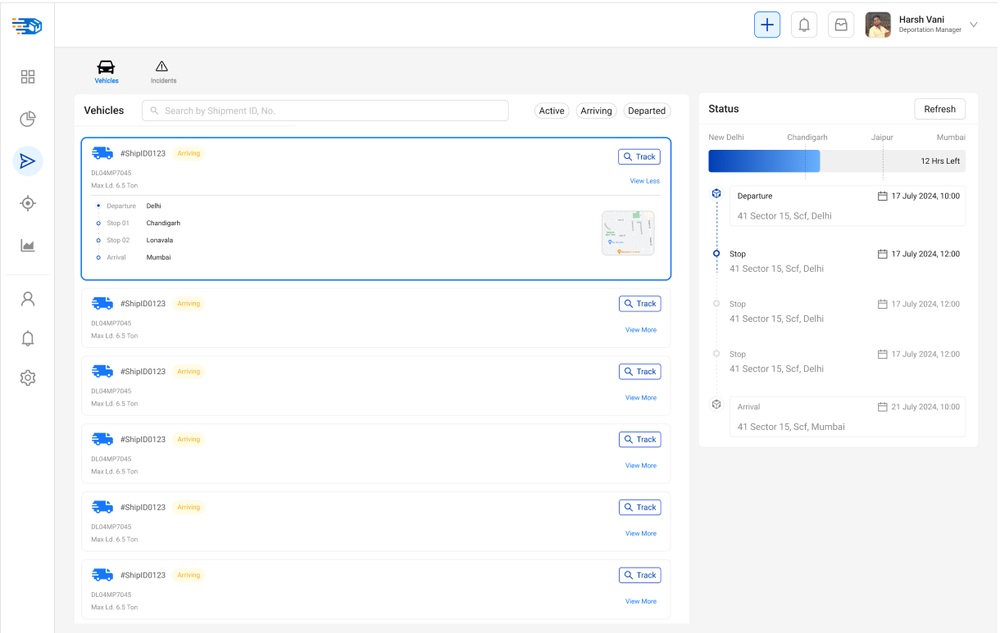
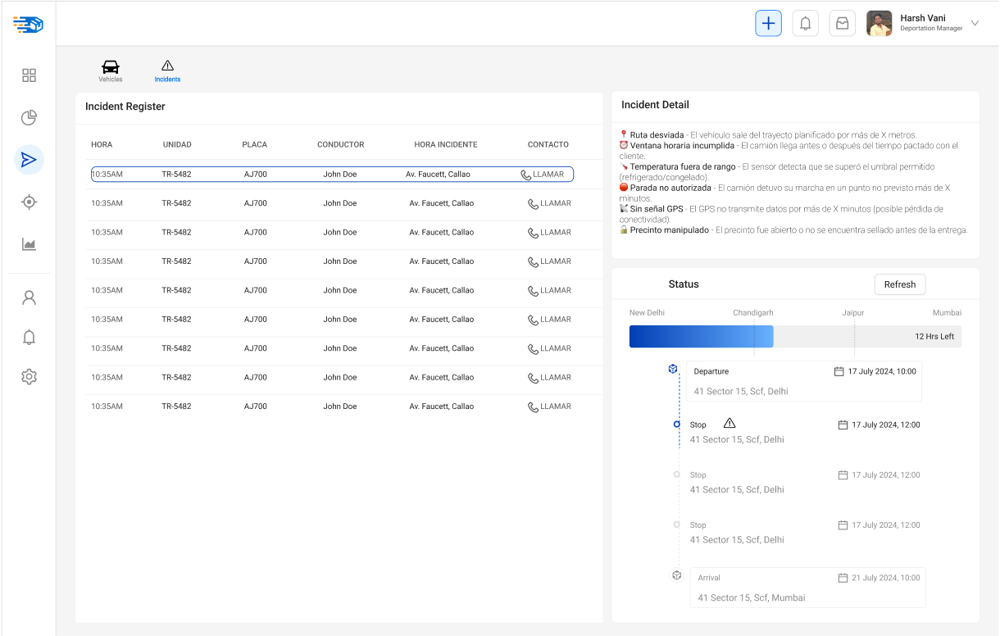
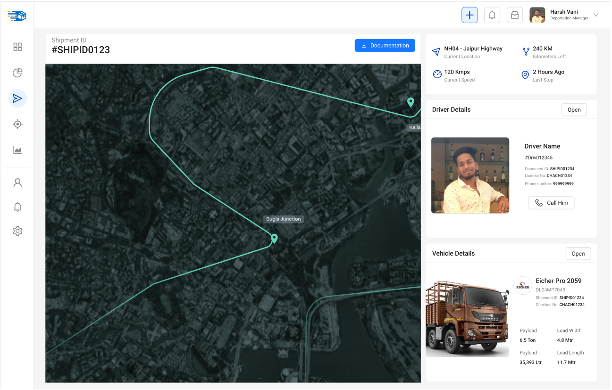

# 3.5. Módulo 5

# Monitoreo en ruta

##  Q&A

### 1. ¿Cuál es el objetivo de su módulo?

El objetivo del módulo de Monitoreo en ruta es rastrear en tiempo real la ubicación de los vehículos de transporte, detectar desviaciones o retrasos respecto al plan de entrega, y generar alertas inmediatas ante incidencias que puedan afectar la cadena logística. Esto permite asegurar la continuidad, trazabilidad y confiabilidad de las entregas mientras están en tránsito.

### 2. ¿A quién beneficia el funcionamiento de su módulo?

 - **Internamente:** beneficia al área de Planeamiento y Logística, ya que permite una supervisión activa del estado de las entregas.
 - **Externamente:** beneficia al cliente final (persona o empresa) al asegurar entregas más puntuales, seguras y transparentes, reduciendo la incertidumbre sobre el estado del pedido.

### 3. ¿Qué resultado genera su módulo? ¿Es un producto o un servicio? ¿Qué características tiene?
El módulo genera un servicio de monitoreo y control en tiempo real de las entregas.

 #### Características del servicio:
   - Seguimiento por GPS de cada unidad de transporte.
   - Registro de eventos e incidencias (desvíos, paradas no autorizadas, retrasos).
   - Generación de alertas automáticas.
   - Visualización en una plataforma centralizada.
   - Base de datos histórica de los recorridos.

### 4. ¿Qué recursos se emplean para obtener dicho resultado?

 - **Tecnológicos:** GPS instalados en los vehículos, plataforma de monitoreo (software), red de datos móviles.
 - **Humanos:** Personal de monitoreo, operadores logísticos, responsables de alertas.
 - **Información:** Datos de planificación de rutas, horarios estimados, ubicación actual de cada unidad.

### 5. ¿Cómo se planifica el uso de estos recursos?

El software de monitoreo se activa automáticamente al iniciar el viaje.
Los recursos humanos se organizan en turnos para garantizar cobertura continua (24/7 si es necesario).
Se definen protocolos de acción ante incidentes y se capacita al personal involucrado.
Se establece un calendario de mantenimiento preventivo de los equipos tecnológicos.

### 6. ¿Cómo se reserva el uso / la propiedad del producto o servicio generado?

El servicio es de uso exclusivo de San Fernando S.A. y forma parte de su infraestructura interna de gestión logística.
La información generada es propiedad de la empresa, se resguarda en servidores seguros y se accede mediante credenciales autorizadas.
Los registros pueden ser utilizados para auditorías, trazabilidad, reclamos y mejora continua, pero no se comparten con terceros sin autorización.

## Requerimientos Funcionales

- **Geolocalización en tiempo real**
  - Visualización de ubicación actual del vehículo sobre mapa.
  - Datos de velocidad, dirección, paradas y ruta planificada vs. ejecutada.

- **Generación de alertas automáticas**
  - Detección en tiempo real de incidentes:
    - 📍 Ruta desviada
    - ⏰ Ventana horaria incumplida
    - 🌡️ Temperatura fuera de rango
    - 🛑 Parada no autorizada
    - 📡 Sin señal GPS
    - 🔓 Precinto manipulado

- **Panel de incidentes**
  - Lista de alertas con filtros por: hora, unidad, placa, conductor, tipo de incidente.
  - Ordenamiento por prioridad o tiempo.

- **Comunicación directa**
  - Botón para llamar o escribir al conductor (integración con telefonía/WhatsApp).

- **Reportes exportables**
  - Descarga de reportes por rango de fechas, unidad o tipo de alerta (Excel o PDF).

---

## 🌟 Atributos de Calidad

| Atributo         | Descripción técnica |
|------------------|---------------------|
| **Disponibilidad** | Sistema disponible 24/7, tolerante a fallos de red o GPS. |
| **Rendimiento**     | Actualización de datos en máximo 5 segundos. |
| **Escalabilidad**   | Soporte para monitoreo de al menos 150 vehículos simultáneamente. |
| **Interoperabilidad** | Compatible con plataformas GPS como Flexi, Bitrack, SimplyRoute, etc. |
| **Usabilidad**      | Interfaz intuitiva, diseño responsive, accesible vía web y móvil. |

---

## 🔐 Restricciones

- Dependencia de cobertura de red móvil y señal GPS.
- Requiere sensores calibrados correctamente (precinto, temperatura).
- Necesaria la integración con APIs de software de gestión de flotas externas.

## Perfil de Usuario

 - **Equipo de soporte logístico:** Encargado de supervisar las unidades en tránsito, validar alertas e intervenir ante incidentes.

 - **Supervisor de transporte:** Realiza seguimiento macro del cumplimiento logístico y evalúa desempeño e incidencias por periodo.

## Opciones del sistema

 - Visualizar mapa en tiempo real con ubicación actual y ruta planificada.
 - Filtrar vehículos por estado: activo, detenido, sin señal o fuera de ruta.
 - Acceder a panel de alertas categorizadas.
 - Contactar al conductor desde la interfaz.
 - Descargar reporte de incidentes por vehículo, rango de fechas o tipo.
 - Visualizar progreso por destino (checkpoints, horas estimadas, porcentaje de avance).

## Casos de Uso

### CU-05: Monitorear Ruta en Tiempo Real
 - Actor: Monitor logístico
 - Flujo Principal:
   - Ingreso al módulo.
   - Selección de unidad de transporte.
   - Visualización de ubicación, velocidad, ruta planificada y real.
 - Resultado esperado: Información sincronizada del vehículo, estado y trayectoria.

### CU-06: Registrar Evento de Incidente
 - Actor: Sistema / Usuario (validación)
 - Flujo Principal:
   - Sistema detecta condición anómala mediante GPS o sensores.
   - Se genera un incidente con categoría automática.
   - Usuario puede validar, editar o contactar al conductor.
 - Resultado esperado: Incidente categorizado con hora, ubicación, unidad y conductor.

## Prototipos

